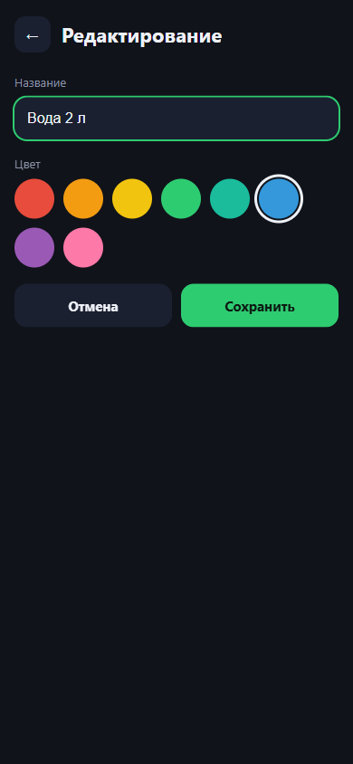
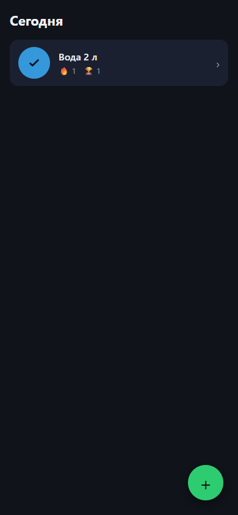
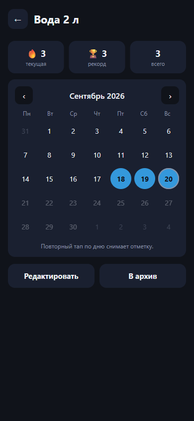
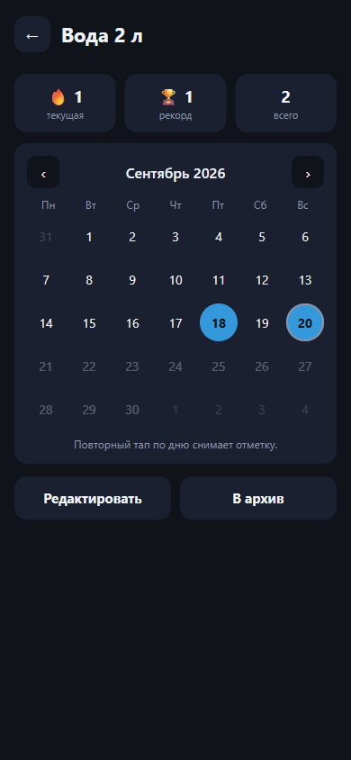

# Кейс — Трекер привычек 🌿

## Проблема и пользователь

Я — учитель, и у меня, как у многих, вечная проблема с простыми ежедневными привычками:
выпить воды, сделать разминку, прочитать десять страниц. Готовые приложения для этого
перегружены: соцсети, лайки, платные подписки, а на то, чтобы просто отметить «сегодня
выполнено», уходит пять кликов по настройкам. Мне же нужно одно: открыть приложение
и одним касанием отметить привычку — и сразу увидеть, сколько дней подряд я держусь,
чтобы не бросить через неделю. Поэтому я сделала минималистичный трекер, в котором
на первом экране нет ничего, кроме списка привычек и отметок, а серия (streak) видна
рядом с каждой привычкой.

## Решение и как оно устроено

- **Стек:** чистый HTML/CSS/JS (ES-модули), без фреймворков и сборки. Данные — только
  в localStorage браузера, поэтому приложение работает без бэкенда и офлайн (PWA:
  манифест + service worker + иконка).
- **Экраны:** «Сегодня» (список привычек с быстрыми отметками), «Календарь привычки»
  (месяц с отметками, текущая и лучшая серия, архив), «Создание/редактирование»
  (название + цвет, ничего лишнего).
- **Данные:** две сущности — привычка `{id, name, color, createdAt, archived}`
  и отметка `{habitId, date}`. Дата — всегда локальная строка `YYYY-MM-DD`.
- **Правила серий и пропусков** зафиксированы в ТЗ: [spec.md](spec.md).
  Главное: серия считается по локальной дате устройства (не по UTC), пропущенный день
  не считается выполненным и сбрасывает серию, сегодняшняя серия считается со вчерашнего
  дня, если сегодня ещё не отмечено.
- **Перенос данных (v2):** экспорт всех данных в один JSON-файл и импорт обратно
  (привычки объединяются по `id`, отметки без дубликатов) — кнопки внизу экрана
  «Сегодня». Так трекером можно пользоваться на нескольких устройствах без бэкенда.

## Демо-сценарий

Все скриншоты — мобильная версия (390×844), интерфейс рассчитан на одну руку:
кнопка «+» и строки привычек в зоне большого пальца, тап-таргеты от 44 px.

1. **Создаю привычку «Вода 2 л»** — название и цвет, без лишних настроек:

   

2. **Отмечаю выполнение одним касанием** с экрана «Сегодня» — круг закрашивается,
   рядом сразу видна серия:

   

3. **Отмечаю три дня подряд** (18, 19 и 20 сентября) в календаре — серия 🔥 3:

   

4. **Пропуск сбрасывает серию.** Снимаю отметку за 19-е (имитация пропущенного дня):
   серия обрушилась с 3 до 1, а пропущенный день не показан как выполненный:

   

## Как проверяла

- **Прогнала ручные тест-кейсы** из [test-cases.md](test-cases.md): создание,
  отметка, сохранение после перезагрузки, серия из 3 дней, пропуск и сброс, снятие
  ошибочной отметки, отключённые будущие дни, редактирование, архив, восстановление,
  экспорт/импорт (файл скачан и развёрнут на «чистом устройстве», повторный импорт
  без   дублей, битый файл не портит данные). Проверку делала в браузере в мобильном
  разрешении 390×844, после каждого шага — перезагрузка страницы; финальную
  проверку прошла на своём телефоне: онлайн-версия работает, отметка удобна
  одной рукой, приложение установлено как PWA на главный экран.
- **Что нашла и исправила по итогам проверки:**
  1. *Архив без возврата.* После архивации привычка исчезала с экрана «Сегодня»,
     и попасть в её календарь (кнопка «Восстановить») не было пути. Добавила
     свёрнутый блок «Архив (N)» внизу главного экрана.
  2. *Падение привязки событий.* Из-за первого же фикса нашла баг: обработчик
     отметки падал на строках архива (у них нет кнопки-круга) — добавила проверку.
- **Типичные ошибки из задания проверяла отдельно:** дата отметки формируется только
  из локальных `getFullYear/getMonth/getDate` (в localStorage видно `"2026-09-20"`),
  никаких `toISOString()`/UTC-дат в логике серий.

## Ограничения и вторая версия (честно)

Что **не вошло в MVP** и почему:

- Гибкий график (выбранные дни недели), график статистики за месяц и напоминания —
  по заданию это v2, сначала должен был заработать простой MVP.
- ИИ-сводка (опциональный пункт задания) не включена: требует API-ключа, который
  по правилам проекта может жить только в `.env`.
- Экспорт/импорт добавлены после сдачи MVP (v2): перенос данных — одним JSON-файлом,
  без бэкенда. Онлайновой синхронизации между устройствами по-прежнему нет.
- Рекорд пересчитывается по текущему набору отметок: если снять отметку из середины
  серии, рекорд уменьшится. Осознанное решение, зафиксировано в ТЗ (п. 3).
- PWA-иконка в SVG: для публикации в сторах понадобятся PNG-размеры.

План v2: гибкий график по дням недели, график статистики за месяц, напоминание
в выбранное время, еженедельная мотивирующая сводка от ИИ (без медицинских советов).

## Ссылки

- **Онлайн-версия (публикация):** https://arenissa.github.io/habit-tracker/
- Репозиторий: https://github.com/arenissa/habit-tracker
- ТЗ и правила серий: [spec.md](spec.md) · Тест-кейсы: [test-cases.md](test-cases.md)
- Локальный запуск: `python -m http.server 8177` → http://localhost:8177 (подробности — в README).